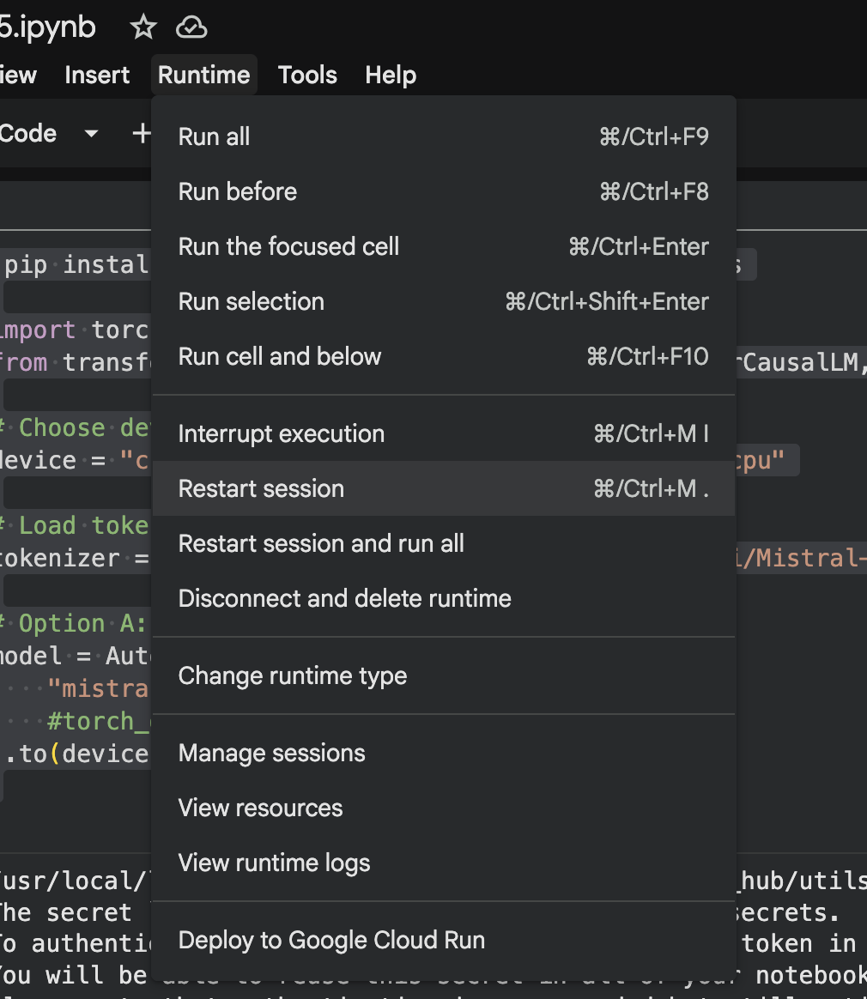

# ai-model-parameters-lesson

A series of guided questions to explore how model size, GPU, and quantization.


# Q1

Visit https://colab.research.google.com/ (create a google account if necessary).  Start a new notebook (It'll be saved on your drive).  

Click on the drop down button at the top right hand corner and choose "change runtime type".


What are the available "runtimes" you can choose?

  a. CPU

  b. T4 GPU

  c. A100

  d. L4

# Q2

Select the T4 GPU runtime type and connect to it.  Which of the following is true?  Select all that applies:

  a. It has 16G RAM

  b. It has 15G VRAM

  c. You get 2 hours of time to use it

  d. You get over 100G of disk space

# Q3

Put the following code in the first cell and run it:

```python
import torch
from transformers import AutoTokenizer, AutoModelForCausalLM

# Load tokenizer and model

device = 'cpu'

tokenizer = AutoTokenizer.from_pretrained("qwen/qwen3-0.6b")
model = AutoModelForCausalLM.from_pretrained("qwen/qwen3-0.6b").to(device)  
```

Select all the TRUE statements:

  a. System RAM is used for the model

  b. GPU RAM is used for the model

  c. The model is downloaded from huggingface

  d. The model size is around 1.5 Gigabytes

# Q4

Now enter this code in the 2nd cell below the 1st cell:

```python
# Optional: compile model for PyTorch 2.x (further speedup)
# model = torch.compile(model)

# Input prompt
prompt = "Once upon a time, in a land far, far away,"

# Tokenize input and move to GPU
inputs = tokenizer(prompt, return_tensors="pt").to(device)

# Generate text
with torch.inference_mode():
    outputs = model.generate(
        **inputs,
        max_new_tokens=100,
        do_sample=True,      # set to False for greedy decoding (faster)
        temperature=0.7
    )

# Decode and print
generated_text = tokenizer.decode(outputs[0], skip_special_tokens=True)
print(generated_text)
```

Run the above cell 3 times.  What was the fastest speed you got out of the above code?

  a. under 10 seconds

  b. 20 to 40 seconds

  c. 40 seconds to 1 minute

  d. Over 1 minute

# Q5

Change the device variable in cell one as follows:

```python
device = 'cuda'
```

And rerun cell 1.  Then run cell 2 three times as above.  What is the fastest time to completion for cell 2?

  a. under 10 seconds

  b. 20 to 40 seconds

  c. 40 seconds to 1 minute

  d. Over 1 minute


# Q6

Reset your runtime as below and delete all cells (you could also just start a new notebook):



Put the following code in cell 1:

```python
# Import libraries
import torch
from diffusers import StableDiffusionPipeline

# Choose device
device = "cuda" if torch.cuda.is_available() else "cpu"

# Load the Stable Diffusion pipeline (512x512 default)
pipe = StableDiffusionPipeline.from_pretrained(
    "runwayml/stable-diffusion-v1-5",  # basic Stable Diffusion model
    torch_dtype=torch.float16           # use half precision for GPU
).to(device)
```

How much GPU RAM is being used for this model?

  a. Under 1G

  b. Between 1-3G

  c. Between 3-4G

  d. Bigger than 4G

# Q7

Enter the following code into cell 2

```python

# Example prompt
prompt = "A futuristic city skyline at sunset, digital art"

image = pipe(prompt, guidance_scale=7.5).images[0]

# Display the generated image in Colab
image
```

How much GPU RAM is being used for this model?

  a. Under 1G

  b. Between 1-3G

  c. Between 3-4G

  d. Bigger than 4G

---

Replace cell 2 with the following where you can experiment with various parameters:

```python
prompt = "A futuristic city skyline at sunset, digital art"

random_seed = random.randint(0, 2**32 - 1)
generator = torch.Generator(device=device).manual_seed(random_seed)
image = pipe(
    prompt,
    guidance_scale=5.0,
    num_inference_steps=50,
    height=512,
    width=512,
    generator=generator
).images[0]

image
```

# Q8

What is the purpose of the random_seed? (Choose all that applies)

  a. Make sure images produced follows the text prompt

  b. Improves generation speed

  c. Controls image size

  d. Make image output deterministic

# Q9

What is the purpose of the num_inference_step? (Choose all that applies)

  a. Make sure images produced follows the text prompt

  b. Improves generation speed

  c. Controls image quality

  d. Make image output deterministic

# Q10

What is the purpose of the guidance_scale? (Choose all that applies)

  a. Make sure images produced follows the text prompt

  b. Improves generation speed

  c. There is no maximum to the guidance_scale

  d. Make image output deterministic